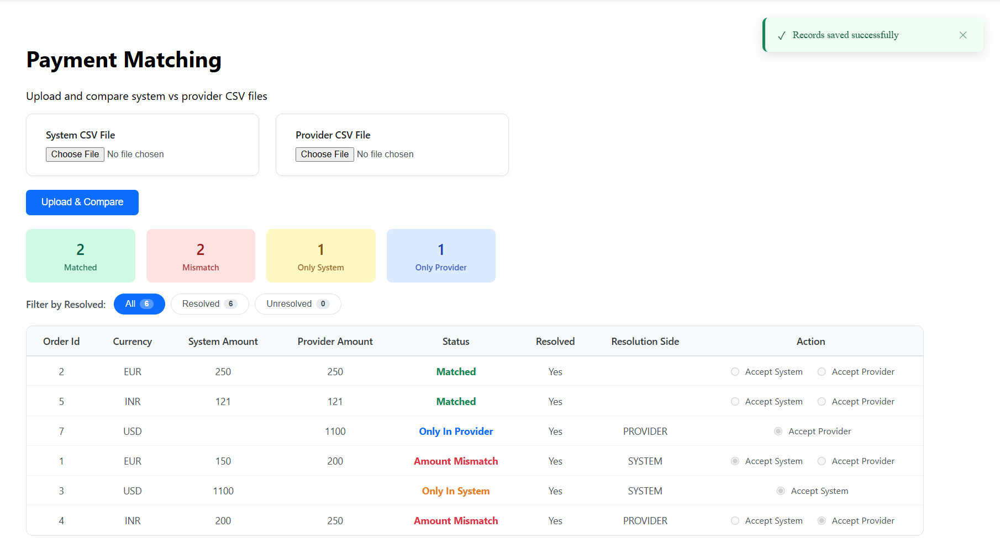
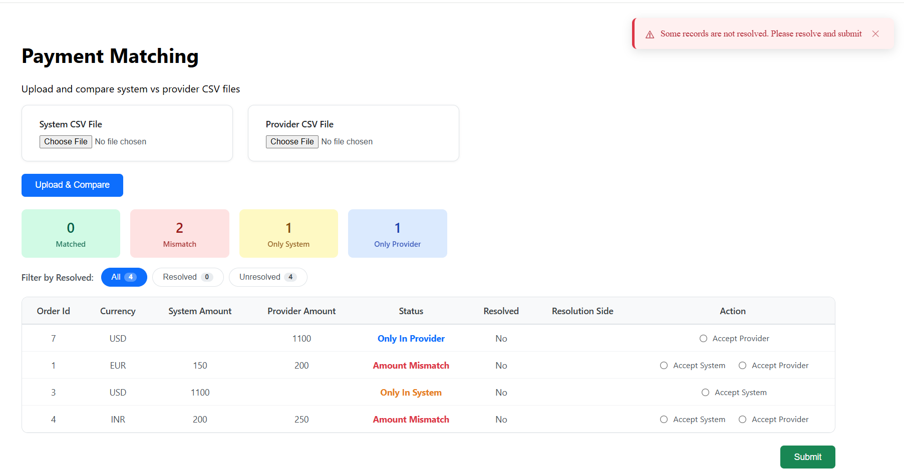
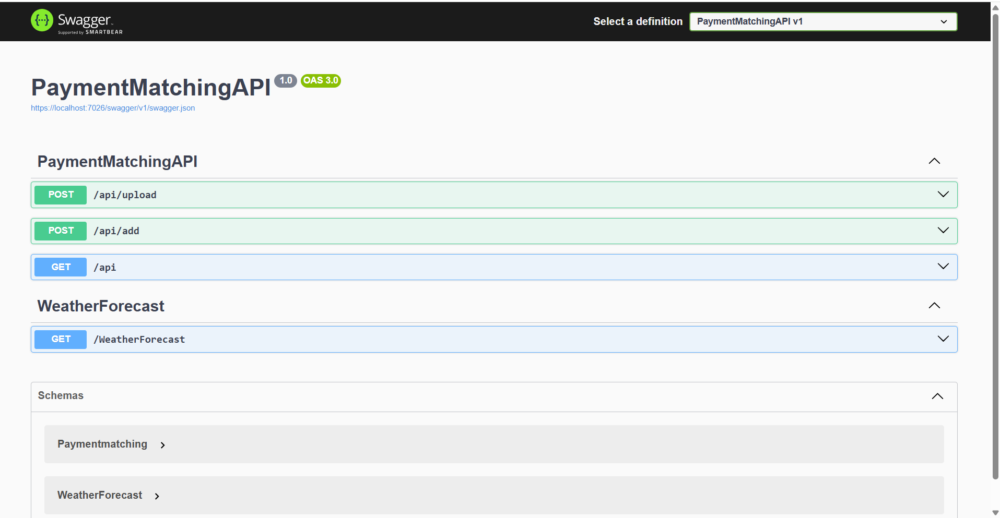

Payments Matching Tool

Overview
Payments Matching Tool is a full-stack web application built using Angular and ASP.NET Core that helps reconcile payment transactions between a system and provider.
The application allows users to upload System and Provider CSV files, compare payment records, identify mismatches, resolve discrepancies, and store reconciliation results in a SQL Server database.
________________________________________
Technology Stack
Frontend
•	Angular 20
•	TypeScript
•	HTML5
•	CSS
Backend
•	ASP.NET Core 8 Web API
•	Entity Framework Core 8
•	Swagger
Database
•	SQL Server
Cloud & DevOps
•	Azure SQL Database
•	Azure Key Vault
•	Azure Blob Storage
•	GitHub
________________________________________
Features Implemented
Payment Matching
•	Able to view all payment records initially.
•	User can upload both System CSV and Provider CSV files.
•	Validation is implemented to ensure both files are selected before upload.
•	Appropriate error messages are displayed when required files are not provided.
Matching Process
•	Payment records are matched using: OrderId + Currency
•	Matching results are categorized into:
  o	MATCHED
  o	ONLYSYSTEM
  o	ONLYPROVIDER
  o	AMOUNTMISMATCH
•	Successfully matched records are stored directly in the database.
•	Unresolved records are displayed in the grid for user review and action.
•	User can select:
  o	Accept System
  o	Accept Provider
•	Resolution side is updated immediately on the UI.
•	User can submit the reconciliation only after all unresolved records are resolved.
•	Upon submission, all payment matching records are persisted to the database.
Grid & Filtering
•	Display all payment records in a tabular format.
•	Summary dashboard showing:
  o	Matched Count
  o	Amount Mismatch Count
  o	Only System Count
  o	Only Provider Count
•	Filter functionality available for:
  o	All Records
  o	Resolved Records
  o	Unresolved Records
User Experience
•	Success messages displayed for successful operations.
•	Error messages displayed for validation failures and processing errors.
Logging & Monitoring
•	Application logging is implemented using Serilog.
•	Logs are stored in Azure Blob Storage for centralized monitoring and troubleshooting.
Security
•	Sensitive connection strings and secrets are stored securely in Azure Key Vault.
•	Application retrieves secrets using Managed Identity and Azure Key Vault integration.
Exception Handling
•	Global Exception Handling Middleware is implemented.
•	All unhandled exceptions are captured and logged.
•	Standardized error responses are returned to the client.
API Documentation
•	Swagger is enabled for API testing and documentation.
Database
•	SQL Server database used for storing payment reconciliation records.
•	Entity Framework Core used for data access and persistence.

________________________________________
Database Schema
PAYMENTMATCHING

ID - int Primary Key
SystemAmount - decimal
ProviderAmount  - decimal
Currency – varchar(200)
Status  -  varchar(200)
Resolved - bit
ResolutionSide -  varchar(200)
OrderId - int	
	
________________________________________
Running the Backend
Prerequisites
•	.NET 8 SDK
•	SQL Server
Restore Packages
dotnet restore
Run Application
dotnet run
Swagger URL: https://localhost:7026/swagger
________________________________________
Running the Frontend
Prerequisites
•	Node.js
•	Angular CLI
Install Packages
npm install
Run Angular Application
ng serve
Application URL:  http://localhost:4200
________________________________________
Screenshots
Payment Matching

Swagger UI

________________________________________
Sample CSV Files

Valid CSV

Invalid CSV with Wrong Header

________________________________________
Author
Sathya M

GitHub Repository:
•	Angular Project: https://github.com/sathya444000/PaymentMatchingAngular.git
•	Backend API: https://github.com/sathya444000/PaymentMatchingAPI.git
